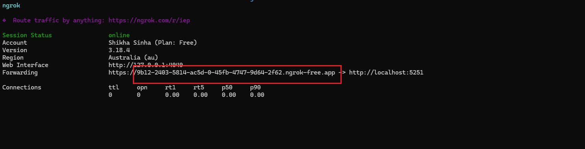
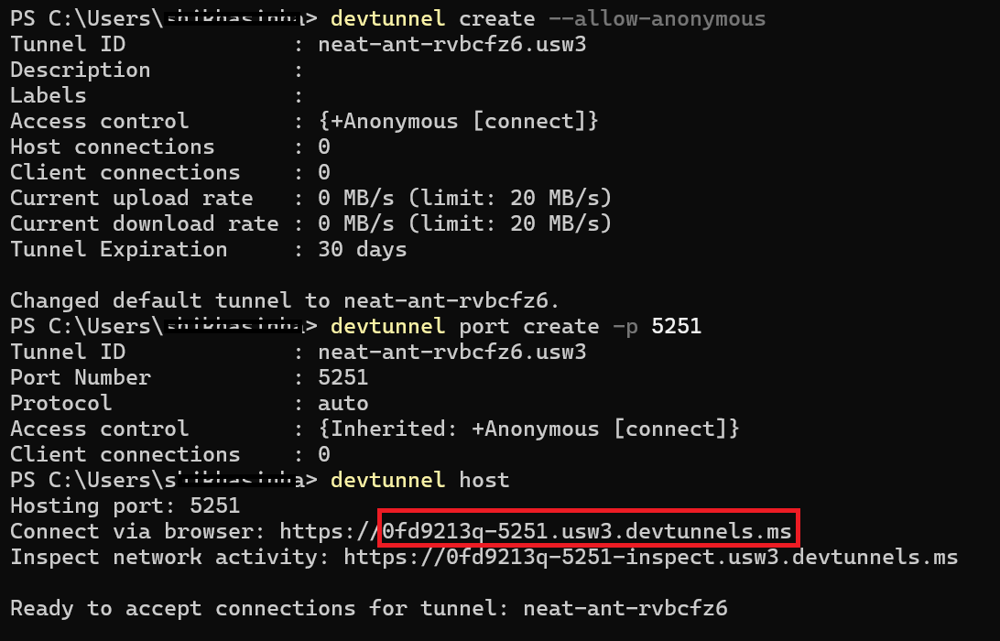
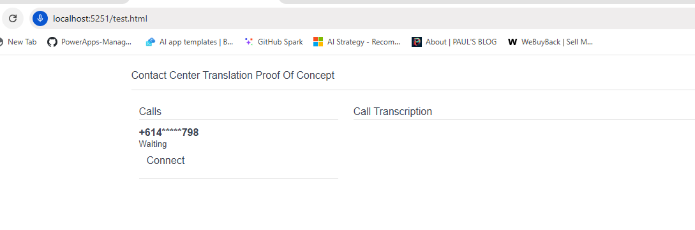
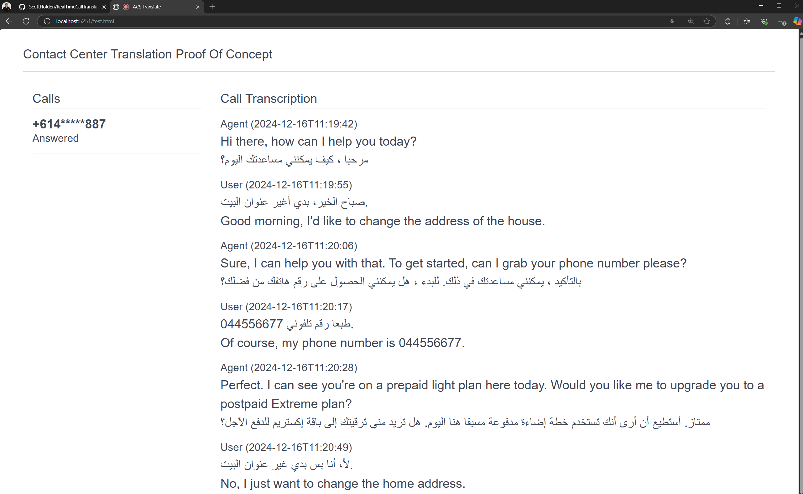

# Live Call Translation

## Overview
A real-time multilingual communication capability between non-English-speaking customers and English-speaking agents and using AI-powered speech translation, ensuring seamless conversations through voice-to-voice interaction.

## Flow
`PSTN/VoIP` <-> `ACS` <-> `Speech Stream` <-> `Translate` <-> `Speech Stream` <-> `ACS` <-> `VoIP`

## Getting Started - Running on Azure
[](https://portal.azure.com/#create/Microsoft.Template/uri/https%3A%2F%2Fraw.githubusercontent.com%2FScottHolden%2FLiveCallTranslation%2Fmain%2Fdeploy%2Fdeploy.generated.json)  
`Estimated deployment time: 8 minutes` 

**IMPORTANT**: Once deployed, make sure you enable built-in authentication for App Service to ensure only you can access the resource. You can do this by navigating to the App Service -> Authentication -> Add Identity Provider. A full guide can be found [here](https://learn.microsoft.com/en-us/azure/app-service/scenario-secure-app-authentication-app-service).   
**If you don't enable authentication, anyone can access the application and accept calls.**

## Pre-requisites - Local Development

1. Azure CLI: [Install Azure CLI](https://docs.microsoft.com/en-us/cli/azure/install-azure-cli)
2. .NET 9: [Download .NET 9](https://dotnet.microsoft.com/en-us/download/dotnet/9.0)
3. Node.js: [Download Node.js](https://nodejs.org/) (Optional for frontend application)
5. ngrok: [Download ngrok](https://ngrok.com/download)
*ngrok is used to expose endpoints for EventGrid subscriptions and websocket traffic*
6. DevTunnel: [Download DevTunnel](https://learn.microsoft.com/en-us/azure/developer/dev-tunnels/get-started?tabs=windows)
>*If you are using a separate frontend application running on a different port than your backend application, then DevTunnel is used to expose endpoints for EventGrid subscriptions and websocket traffic as it supports multiple ports by `allow-anonymous` capability*

## Getting Started - Local Development
1. Clone the repo
    ```sh
        git clone https://github.com/ScottHolden/LiveCallTranslation
        cd LiveCallTranslation
        ```
2. Deploy Azure Resources 
    Deploy the infrastrucure as code bicep template in the 'deploy' folder 
    - Change the `adminObjectId` with the `objectId` of the user who will have access to the resources.
    - To get the `objectId`:
      1. Go to the Azure portal.
      2. Navigate to "Azure Active Directory".
      3. Select "Users" from the menu.
      4. Find and select the user who will have access to the resources.
      5. Copy the "Object ID" from the user's profile.

    - Run the Bicep file using the following command:
      ```sh
      cd deploy
      az deployment group create --resource-group <your-resource-group> --template-file deploy.bicep
      ```
 - If you are using existing Azure resources, make sure you have following permissions assigned to the resources: 
    - Communication and Email Service Owner on the Azure Communication Service resource
    - EventGrid Contributor on the EventGrid Topic
    - Cognitive Services Speech User on the Azure Speech resource

3. For testing purposes, if you don't already have one, you need to purchase a number in Azure Communication Service with calling capabilities. [Learn how to purchase a phone number](https://learn.microsoft.com/en-us/azure/communication-services/quickstarts/telephony/get-phone-number?tabs=windows&pivots=platform-azp). **If you don't purchase a number, you can use the user test interface to simulate a call.**

4. To run the application locally, run ngrok to expose endpoints for EventGrid subscriptions and websocket traffic. Start ngrok with `ngrok http 5251` and note the forwarding address. 
  *Copy only the hostname. Do not copy `https:\\`*
 
 *If you are unable to use ngrok, you can use DevTunnel to expose endpoints for EventGrid subscriptions and websocket traffic. Start DevTunnel with 
    `devtunnel create --allow-anonymous`
    `devtunnel port create -p 5251`
    `devtunnel host`
     and note the forwarding address.  *Copy only the hostname. Do not copy `https:\\`*

5. Copy *appsettings.json* to *appsettings.Development.json* and fill in the following values:
    - `Connection strings` -> `SQLDB` if you want persistent storage for the call queue. Leave it blank for in memory storage.
    - `AzureTenantId`: TenantId of the Azure Subscription where the resources are deployed
    - `Translator`: Choose between `AzureAISpeech` or `AzureOpenAI`
    - `AzureAISpeech` -> `ResourceID`: Required only if Translator is set to `AzureAISpeech`. Navigate to your Azure Speech resource in the Azure portal -> Properties -> Resource ID
    - `AzureAISpeech` -> `Region`: Required only if Translator is set to `AzureAISpeech`. Region where your Azure Speech resource is deployed
    - `AzureOpenAI` -> `Endpoint`: Required only if Translator is set to `AzureOpenAI`. Endpoint of your Azure OpenAI resource
    - `AzureAISpeech` -> `Deployment`: Required only if Translator is set to `AzureOpenAI`. Deployment name of your Azure OpenAI resource
    - `Inbound` -> `Hostname`: forwarding address of ngrok or DevTunnel captured in previous step without https://
        *- for example: `<some-guid>.ngrok-free.app`* or `<some-guid>.devtunnels.ms`
    - `ACS` -> `Endpoint`: Endpoint url of your Azure Communication Services resource
    - `EventGrid` -> `TopicResourceID`: ResourceID of EventGrid Topic.
    >*This setting is required only when you want the application to auto-configure the EventGrid subscription on startup, otherwise leave it blank if you want to configure it manually.(This also applies to deployments to Azure so it can validate the endpoint)*
    >*If you are configuring the subscription manually, ensure you have EventGrid Contributor on the EventGrid Topic*

        * To get the `ResourceID` of EventGrid Topic:
            1. Go to the Azure portal.
            2. Navigate to "Event Grid Topics".
            3. Select the Event Grid Topic you want to use.
            4. Copy the "Resource ID" from the Event Grid Topic's Properties.*

6. To run the backend application, execute the following commands:
    ```sh
    cd src/ACSTranslate.API
    dotnet run
    ```
    - Make sure you are logged into the Azure CLI
    - Backend application will be running on port 5251 : http://localhost:5251

    * Navigate to http://localhost:5251/test.html to see the interface for agent: 
    

    * Call the number you configured from a mobile. 
once the call connects you can refresh the web interface to see the call show in the queue.

    * Click the call to connect to the call, live translation will be started.
    

    * To end the call, disconnect the call on mobile, and just refresh the test web interface.